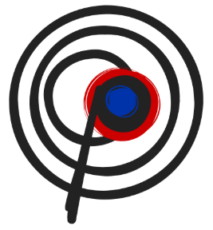
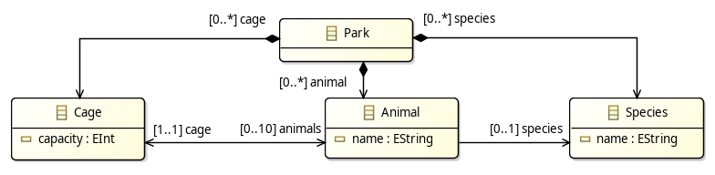

# OOCP
**Object Oriented _Constraint_ Programming**
Interpreter from UML&OCL to CSP, using the semantics provided by [OCLinChoco](https://github.com/ArtemisLemon/OCLinChoco), modeled using the [Choco Solver](https://choco-solver.org/), to solve [Eclipse EMF]() models.

<!-- ## 2 Interpreters:
- XMI2Choco : which makes a Choco Model from an XMI file 
- OCL2Choco : which adds to the Choco Model from an OCL file -->

## Quick Start
```
git clone git@github.com:ArtemisLemon/OOCP.git
git submodule update --remote
./gradlew build
./gradlew run --args="-M metamodel -m model -c constraints"
```

## Example Models
### [zoo.xmi](https://github.com/ArtemisLemon/OOCP/blob/master/OCL2Choco/testmodels/zoo/zoo.xmi) : Input Model and Metamodel
```xml
<zooModel:Park>
  <species name="Lion"/>
  <species name="Gnou"/>
  <animal species="//@species.1" name="gNathan"/>
  <animal species="//@species.1" name="gNathalie"/>
  <animal species="//@species.0" name="Lea"/>
  <animal species="//@species.0" name="Leo"/>
  <animal species="//@species.0" name="Lou"/>
  <cage capacity="2"/>
  <cage capacity="4"/>
</zooModel:Park>
```
 This model should conform to the [zoo.ecore](https://github.com/ArtemisLemon/OOCP/blob/master/OCL2Choco/testmodels/zoo/zoo.ecore) metamodel. But according to the metamodel the animals shoulds be in cages, and the model is missing that information. Using both the model and metamodel we make a Choco model of the instance.


Eclipse provides graphical tools to make a metamodel.ecore and model.xmi, and model transformation tools which can help with pre-processing.


### [zoo.atl](https://github.com/ArtemisLemon/OOCP/blob/master/OCL2Choco/testmodels/zoo/zoo.atl) : Input Constraint Model
```atl
helper context Zoo!Cage def: cageCapacity(): Boolean = 
    self.animals.size() <= self.capacity;

helper context Zoo!Cage def: OneSpeciesPerCage(): Boolean = 
    self.animals.species.asSet().size() <= 1;
```
OCL can be used to describe additional constraints. The metamodel provides a first set of constraints, such as the cardinality of the `Animals.cage` being `[1..1]`. But each cage has their own capacity,and that detail cannot be expressed in pure UML. Additionally, we wish to specify that _only animals of the same species may be in the same cage_.

### Output Solution.xmi:
```xml
<zooModel:Park>
  <species name="Lion"/>
  <species name="Gnou"/>
  <animal cage="//@cage.0" species="//@species.1" name="gNathan"/>
  <animal cage="//@cage.0" species="//@species.1" name="gNathalie"/>
  <animal species="//@species.0" name="Lea"/>
  <animal species="//@species.0" name="Leo"/>
  <animal species="//@species.0" name="Lou"/>
  <cage animals="//@animal.1 //@animal.0" capacity="2"/>
  <cage animals="//@animal.3 //@animal.2 //@animal.4" capacity="4"/>
</zooModel:Park>
```

## Future Work: .var() Annotation
You can annotate the .atl model to guide CSP building and solving: 
`src.var(prop, ...)`
- choose between optimisation, fixing, exploration, etc..
- limit the scope of the solver on large models
- no annotations does model validation and simple completion

## UML&OCL Coverage